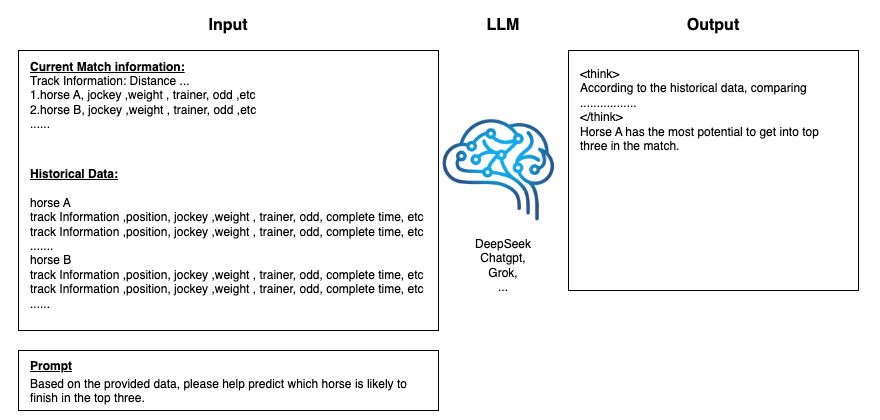

# llm-HorseRacingEvaluation
Idea : 
Since the release of DeepSeek, large language models (LLMs) have demonstrated significant reasoning capabilities. Leveraging their analytical skills, they hold great potential to enhance the accuracy of data analysis. One idea that comes to mind is providing historical horse racing results to GPT and asking it to predict the outcomes of current matches.

